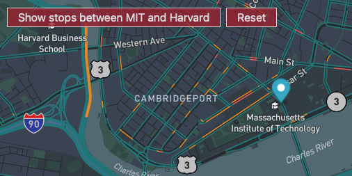

# Bus Tracker Exercise ReadMe
## Geospatial mapping of bus transit

TITLE:
Bus Tracker Application

DESCRIPTION:
This application shows bus stops from MBTA (Massachusetts Bay Transportation Authority) between MIT and Harvard.

HOW TO RUN:
The software is hosted on github here https://github.com/cincimatti/Bus-Tracker-Exercise.
It can be reached at https://cincimatti.github.io/Bus-Tracker-Exercise/ for live demonstrations.

ROADMAP:
1.) ROADMAPPED FEATURES: Additional user selectable bus routes 
2.) ROADMAPPED FEATURES: Time of Day for each Stop

OPERATING INSTRUCTIONS:
The web URL will open a map using the Mapbox API with a view assigned to Cambridgeport in MA. 
There are two buttons located at the top left side of the screen for user controls.
The button labeled "Show Stops between MIT and Harvard" will show markers assigned to MBTA bus stops with specific Lat/Long coordinates.
To replay the markers the user may select the "Reset" button to startover.

LICENSE INFORMATION: Licensing information can be found in the Bus-Tracker-Exercise repo locate the "LICENSE" file.